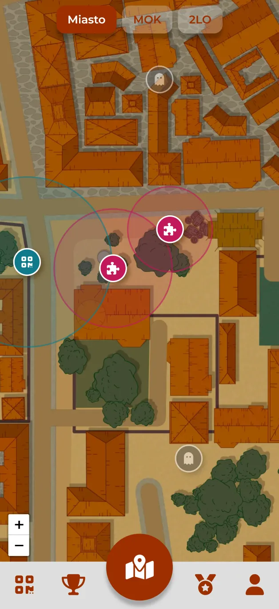
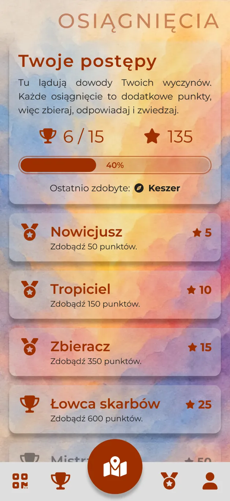
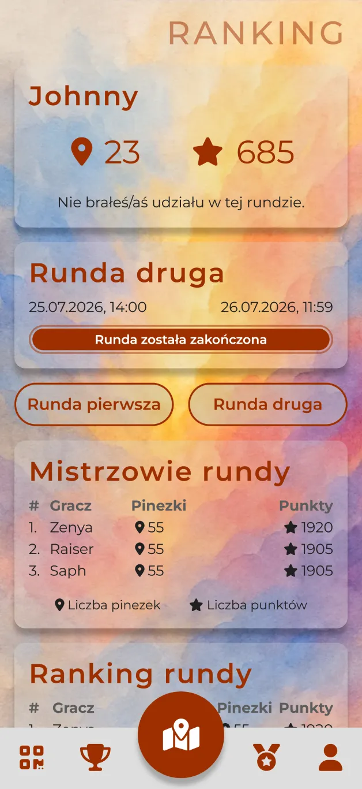
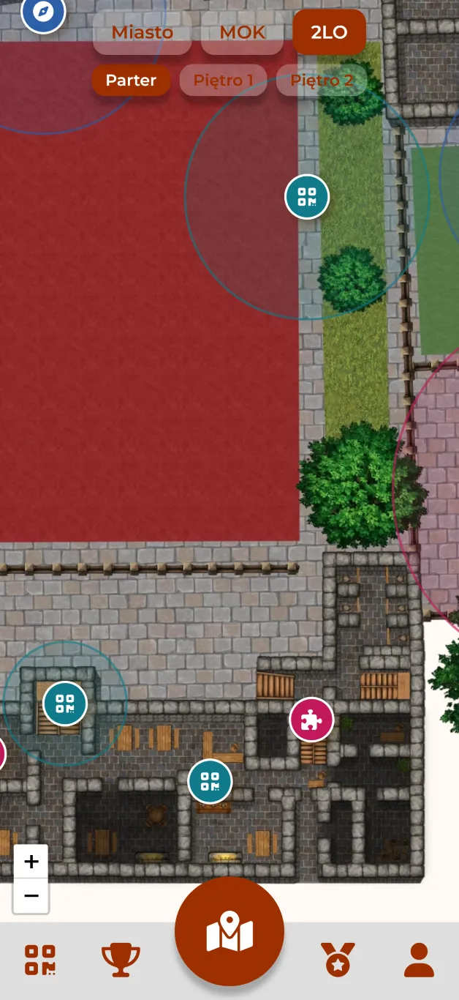
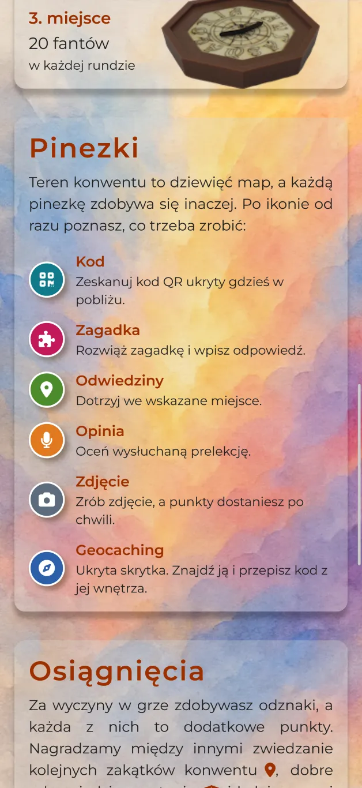
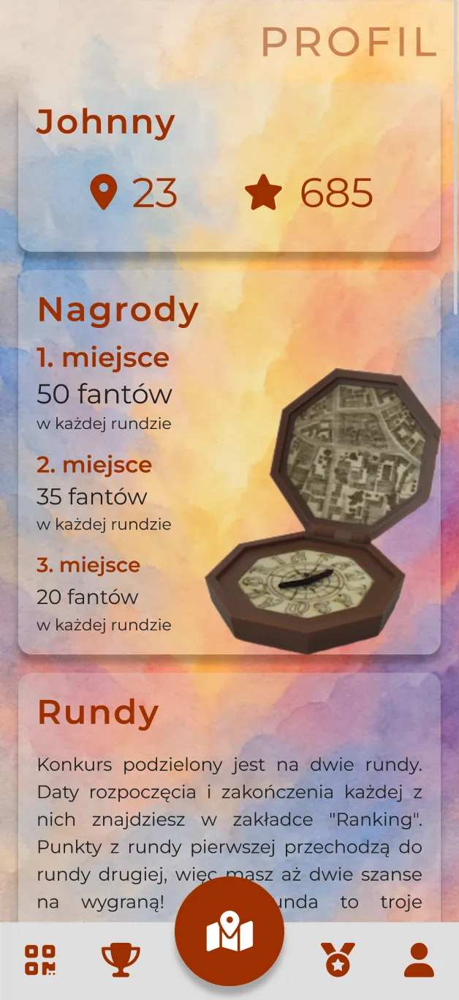
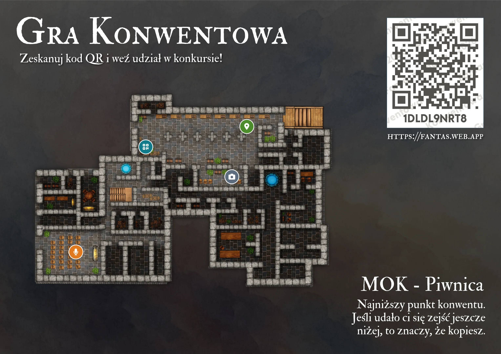
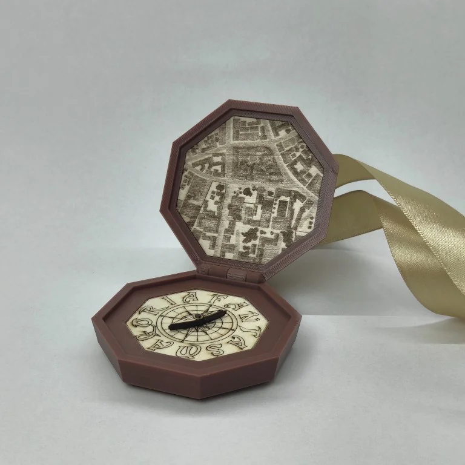

# QrContest / Gra Konwentowa

A game made for people who come together once a year to escape routine.  
Built by a volunteer, played by strangers, remembered by everyone who took part.

In the app it is called **Gra Konwentowa**. QrContest is the legacy repository name.

<table>
  <tr>
    <td></td>
    <td></td>
    <td></td>
  </tr>
</table>

## Overview
QrContest is a mobile web app used during the **Fantasmagoria** fantasy convention in Gniezno, Poland.  
It turns the entire convention area into a giant scavenger hunt.  
Participants open a map of the venue, hunt for pins hidden across its floors, answer questions, unlock achievements, and climb the leaderboard.  
Every year brings new content, new challenges, and new things to find.

Fantasmagoria is a non-profit event made by people who simply enjoy creating fun for others.  
QrContest exists because of that spirit - no sponsors, no budget, no monetization.  

| Year | Edition            | Stack                                                  |
|------|--------------------|--------------------------------------------------------|
| 2026 | 16th Fantasmagoria | Next.js / React / TS / Firestore / Firebase / Tailwind |
| 2025 | 15th Fantasmagoria | Next.js / React / TS / Firestore / Firebase / Tailwind |
| 2024 | 14th Fantasmagoria | Next.js / React / TS / Firestore / Firebase / Tailwind |
| 2023 | 13th Fantasmagoria | Next.js / React / TS / Firestore / Firebase / Tailwind |
| 2022 | 12th Fantasmagoria | PHP / Laravel / MySQL / React / Mantine                |
| 2018 | ZSEO High School   | PHP / MySQL / React / Bootstrap                        |
| 2017 | ZSEO High School   | PHP / MySQL / Bootstrap                                |

The stack has not changed since 2023, but the game has.  
Until 2026 it was built around collectible cards hidden as printed QR codes, kept in a gallery.  
The 2025 edition ran a *“Tysiąclecie Koronacji Polski”* theme with 64 collectible cards depicting best pop culture quotes.  
The 2024 edition had 64 cards that showed creatures, places, events, all telling the game lore story, each with a DALL-E 3 image.

## Motivation
QrContest started as an experiment in high school - few PHP scripts and Bootstrap pages for a “Day of IT” event.  
It was inspired by a game I saw at a student IT festival in Kraków in 2016. 
Simple idea, instant success. People ran through school hallways scanning codes, shouting hints, laughing. 
It worked because it gave them something fun to do together.

Years later, while organizing Fantasmagoria, I decided to rebuild it.  
Every rewrite was from scratch - different technology, same idea: **make people move, explore, and smile.**  
Today QrContest is part of the convention’s identity. It changes every year but keeps the same heart.

<table>
  <tr>
    <td></td>
    <td></td>
    <td></td>
  </tr>
</table>

## 2026 Edition
For the 16th Fantasmagoria the game was rebuilt around a map. Cards are gone.  
There are seven kinds of pin now, and each one is collected differently.

| Pin            | How you collect it                                                                 |
|----------------|------------------------------------------------------------------------------------|
| **code**       | find a printed QR hidden somewhere and scan it                                     |
| **riddle**     | read the clue, work out the answer, type it in                                     |
| **visit**      | just be there, and tap collect                                                     |
| **feedback**   | sit through a talk and rate it                                                     |
| **photo**      | photograph something and wait for a moderator to approve it                        |
| **ghost**      | find a code hidden in the app’s own text - the rulebook, the FAQ, solve the riddle |
| **geocaching** | find a real cache and enter the code inside it                                     |

Some pins also draw a quiz question for extra points.  
Achievements replaced the old gallery - badges for score, for correct answers, for clearing a floor or a whole pin type.

Photo pins were new, and they are the first thing in the game a player cannot finish alone, as it required a moderator to approve.
The upload waits in a queue and scores nothing until a moderator approves it.

## The map
The map is the first thing you see when you open the app, and it is where the whole game happens.

Nine hand-drawn floor plans of real places - the town, five levels of the MOK culture center, three of the 2LO high school. 
Nothing tracks you. There is no dot following you around the building. 
You work out where you are by looking at the drawing, then looking up at the room.

Some markers are exact. Others are just a circle - it is somewhere in here, go and find it. 
Tap one, and it opens with its clue, and that is where you answer, scan, or send a photo.  
Collected pins grey out, so a floor shows you at a glance how much of it you have left.  

## Design & Architecture
The app is built with **Next.js** and hosted on **Firebase**. 
It uses server-side rendering for the front layer and Firestore as the real-time database. 
Cloud Functions handle privileged actions like registration, collecting a pin, grading answers, ranking, and score updates. 
Authentication is handled by Firebase Auth - Google sign-in, with email and password as a fallback.

Clients never write to the database. Every change goes through a Cloud Function.  
Pin codes and quiz answers stay on the server and never reach the browser.

Structure:
- **Frontend:** React + Tailwind + Next.js
- **Backend:** Firebase Cloud Functions
- **Database:** Firestore (non-relational)
- **Storage:** Firebase Storage, for player photos
- **Admin panel:** integrated dashboard for moderators, with an in-map pin editor and a photo review queue
- **Dashboard mode:** TV display for rankings, convention agenda, and announcements  
- **Deployment:** Firebase CLI (CI/CD not required)

The app runs for the duration of the event and performs over 100k read/write operations in less than three days.

## Gameplay & Features
Players sign in and create an account. 
They walk through the convention area with the map open, looking for pins - in rooms, hallways, gardens, on lampposts, and more.  
Some are printed QR codes. Some are riddles about the place you are standing in. Some are photos to take.  
Certain pins ask a quiz question; correct answers yield extra points. Ranking updates are instantly visible to everyone on leaderboards.

Core features:
- map of nine venue floors, seven types of pin
- achievements for score, answers, locations, and pin types
- moderated photo quests
- timed rounds with prizes, closed automatically
- live, synchronized ranking
- admin tools for event coordination, with an in-map pin editor
- dashboard for TVs and projectors
- localized Firestore rules for data security

2026 event stats:
- 97 players, and every one of them collected at least one pin
- 2,580 pin collects across 55 pins - none of the 55 went unfound
- 18 players collected all of them
- 1,690 quiz answers, 75.8% correct, from a pool of 220 questions
- 237 photo submissions

Taken from a read-only copy of the database made after the event.  
The full write-up, including what did not work, is in [docs/2026-postmortem.md](docs/2026-postmortem.md).

## Challenges
The main challenge was **data consistency**. One pin collect can award points, grade a quiz answer, unlock an achievement, and move somebody up the leaderboard. All of it has to happen together or not at all.

Every score is stored in four places at once, because a leaderboard that joins across documents is slow.  
Keeping those four copies in agreement is most of the work.  
Each award has to read the player inside the transaction, not before it. Otherwise two collects at the same moment both decide an achievement was just earned, and both add the bonus. Nothing repairs that afterwards.  
The achievement engine only reads and returns a list of what to grant, with the writing code outside it, so a bad badge costs the badge and not the points.  
Round winners and the live ranking share one sort function, used by the server and the browser alike. Two versions of it would eventually disagree in front of someone holding a prize.

None of this can be checked by reading it, so the tests run against real Firebase emulators and call the real functions.  
The main one collects a pin, answers a question, and checks the score matches in all four places.

## Deployment & Operation
The app runs independently during the three days of the convention. It’s monitored and maintained on-site.  
Printed QR codes and physical caches are hidden around the venue before the event and collected afterward.  
Winners are announced in the app, and prizes (convention currency) are handed out in a small ceremony.  
After the event, the app remains online for a few weeks for archives and results.

## Tech Stack
- Next.js 13.5
- React with TypeScript
- Firebase (Firestore / Hosting / Storage / Auth / Functions)
- Leaflet for the venue maps
- Tailwind CSS

## Future Work
* close the drop-off after the first scan - 16% of players collected one pin and stopped
* replace free-text talk feedback with a list picked from the convention programme
* faster photo review, or approve automatically and moderate the exceptions
* improved admin panel for easier moderation

## License / Credits
QrContest is a non-commercial, volunteer-driven project developed for the **non-profit Fantasmagoria Convention**.  
Built by people who give their time so others can have fun.

Lore and art support by **Igor** and **Damian**.
Created and maintained by **Roman Dąbal**.

